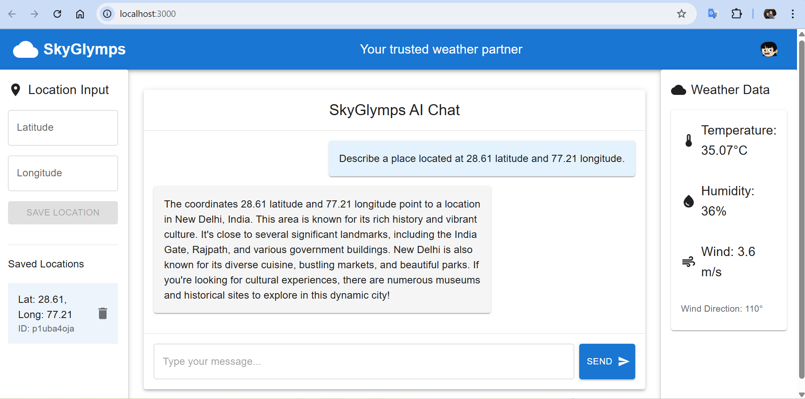

# SkyGlymps - AI Chat Application

A MERN stack application with AI integration, featuring a beautiful UI/UX for chat interactions.

## Features

- Modern React frontend with Material-UI
- Express.js backend with MongoDB integration
- OpenAI ChatGPT integration
- Real-time chat interface
- Responsive design

## Prerequisites

- Node.js (v14 or higher)
- MongoDB Atlas Account (Free tier)
- OpenAI API key

## Virtual Environment Setup

### Windows
```powershell
# Create a virtual environment
python -m venv venv

# Activate the virtual environment
.\venv\Scripts\activate

# Verify activation (you should see (venv) in your terminal)
```

To deactivate the virtual environment when you're done:
```bash
deactivate
```

## OpenAI API Key Setup

1. Create an OpenAI Account:
   - Go to [OpenAI Platform](https://platform.openai.com/signup)
   - Sign up for an account or log in if you already have one

2. Access Your API Keys:
   - Click on your profile icon in the top-right corner
   - Select "View API keys" from the dropdown menu
   - Or go directly to [API Keys page](https://platform.openai.com/account/api-keys)

3. Create a New API Key:
   - Click "Create new secret key"
   - Give your key a name (e.g., "SkyGlymps Project")
   - Click "Create secret key"
   - **IMPORTANT**: Copy the API key immediately - you won't be able to see it again!
   - Store it securely

4. Add to Your Environment:
   - Open your `.env` file in the backend directory
   - Replace `your_openai_api_key` with the key you copied
   - Save the file

Note: OpenAI offers free credits for new accounts, but you'll need to add a payment method to continue using the API after the free credits are exhausted.

## MongoDB Atlas Setup

1. Create a MongoDB Atlas Account:
   - Go to [MongoDB Atlas](https://www.mongodb.com/cloud/atlas/register)
   - Sign up for a free account
   - Choose the "FREE" tier (M0)

2. Create a New Cluster:
   - Click "Build a Database"
   - Choose "FREE" tier
   - Select your preferred cloud provider and region
   - Click "Create Cluster"

3. Set Up Database Access:
   - In the left sidebar, click "Database Access"
   - Click "Add New Database User"
   - Choose "Password" authentication
   - Create a username and password (save these!)
   - Set privileges to "Read and write to any database"
   - Click "Add User"

4. Set Up Network Access:
   - In the left sidebar, click "Network Access"
   - Click "Add IP Address"
   - Click "Allow Access from Anywhere" (for development)
   - Click "Confirm"

5. Get Your Connection String:
   - In the left sidebar, click "Database"
   - Click "Connect"
   - Choose "Connect your application"
   - Select "Node.js" as your driver
   - Copy the connection string
   - Replace `<password>` with your database user password
   - Replace `myFirstDatabase` with your database name (e.g., `SkyGlymps`)

Your final connection string should look like:
```
mongodb+srv://<username>:<password>@cluster0.xxxxx.mongodb.net/SkyGlymps?retryWrites=true&w=majority
```

## Setup

1. Clone the repository
2. Install dependencies:
   ```powershell
   # Install root dependencies
   npm install
   
   # Install frontend dependencies
   cd frontend
   npm install
   cd ..
   
   # Install backend dependencies
   cd backend
   npm install
   cd ..
   ```

3. Create a `.env` file in the backend directory with the following variables:
   ```
   MONGODB_URI=your_mongodb_connection_string
   OPENAI_API_KEY=your_openai_api_key
   OPENWEATHER_API_KEY=your_openweather_api_key
   ```

4. Start the development servers:
   ```powershell
   # Start both frontend and backend servers
   npm start
   
   # Or start them separately:
   # Start backend server
   cd backend
   npm run dev
   
   # In a new terminal, start frontend server
   cd frontend
   npm start
   ```
This will start both the frontend (port 3000) and backend (port 5000) servers.

## Project Structure

```
SkyGlymps/
├── frontend/           # React frontend
│   ├── public/        # Static files
│   │   ├── index.html
│   │   └── favicon.ico
│   ├── src/
│   │   ├── App.js     # Main application component
│   │   └── index.js   # Entry point
│   └── package.json   # Frontend dependencies
├── backend/           # Express backend
│   ├── models/        # MongoDB models
│   │   └── User.js    # Location schema for MongoDB
│   ├── server.js     # Main server file
│   └── package.json  # Backend dependencies
└── package.json      # Root package.json
```


